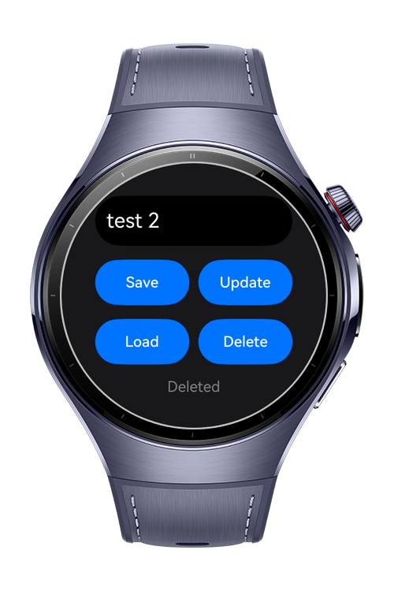

> **Note:** To access all shared projects, get information about environment setup, and view other guides, please visit [Explore-In-HMOS-Wearable Index](https://github.com/Explore-In-HMOS-Wearable/hmos-index).

# How to Implement Secure Storage with Asset Store Kit
This sample demonstrates how to integrate **Asset Store Kit** to securely store sensitive information on the device. Asset Store Kit features adding key-values, updating values, and delete operations on the stored values

# Preview
<div>
  
  
  
  
</div>

# Use Cases
- Store sensitive information on the device securely. (Such as keys, secrets, tokens etc.)

# Tech Stack
- **Language:** ArkTS
- **Framework**: HarmonyOS SDK 6.1.0(23)
- **Tools** DevEco Studio 6.1.1 Release
- **Libraries**:
  - **Asset Store Kit:** `asset` used to manage the Asset Store Kit
  - **ArkTS:** `util` used for the `TextEncoder` and `TextDecoder`
  - **Basic Services Kit:** `BusinessError` used for typed error handling

# Directory Structure
```
entry/src/main/
├── ets/
│   ├── pages/
│   │   └── Index.ets          # Main page to showcase the AssetStore
│   └── storage/
│       └── AssetStore.ets     # AssetStore service implementation using Asset Store Kit
└─── module.json5
```

# Constraints and Restrictions
## Supported Devices
- Huawei Watch 5/6
- Huawei Watch Kids X1
- DevEco Studio Simulator

# LICENSE
**How to Implement Secure Storage with Asset Store Kit** is distributed under the terms of the **MIT License**.
See the [LICENSE](/LICENSE) for more information.
